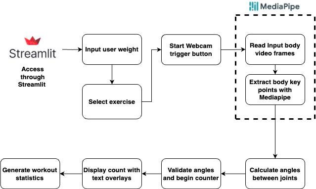

# Exercise Tracking Application

This application uses computer vision and machine learning techniques to track various exercises such as bicep curls, squats, and lunges, and calculates the calories burned during these activities. The application utilizes OpenCV for real-time webcam video processing and MediaPipe for pose estimation.




## Features

- **Real-time Exercise Tracking**: Uses your webcam to track exercises.
- **Bicep Curls Tracking**: Counts the number of bicep curls and calculates calories burned.
- **Squats Tracking**: Counts the number of squats and calculates calories burned.
- **Lunges Tracking**: Counts the number of lunges and calculates calories burned.
- **Visual Feedback**: Provides real-time visual feedback on exercise performance and progress.

## Installation

1. **Clone the Repository**
    ```sh
    git clone https://github.com/KruthiNagabhushan/Pose-Estimation-for-Workout-Tracking.git
    cd Pose-Estimation-for-Workout-Tracking
    run streamlit app.py
    ```


## Usage

1. **Run the Application**
    ```sh
    streamlit run app.py
    ```

2. **Select an Exercise**
    - Open the application in your browser.
    - Select the exercise you want to track: Bicep Curls, Squats, or Lunges.
    - Enter your weight (for calorie calculation).

3. **Start Webcam**
    - Click on the "Use Webcam" button to start tracking your exercise.
    - Follow the instructions displayed on the screen for the selected exercise.

4. **Stop Webcam**
    - Click on the "Stop Webcam" button to stop tracking and get the total calories burned.

## How It Works

- The application captures video from your webcam.
- It uses MediaPipe's pose estimation to detect key landmarks on your body.
- The angles between key landmarks are calculated to determine the stage of the exercise (e.g., up or down).
- Repetition counts and exercise duration are tracked.
- Calories burned are calculated based on the MET (Metabolic Equivalent of Task) values for each exercise and your weight.

## Dependencies

- **OpenCV**: For video capture and image processing.
- **MediaPipe**: For pose estimation.
- **Streamlit**: For creating the web interface.
- **NumPy**: For numerical operations.


